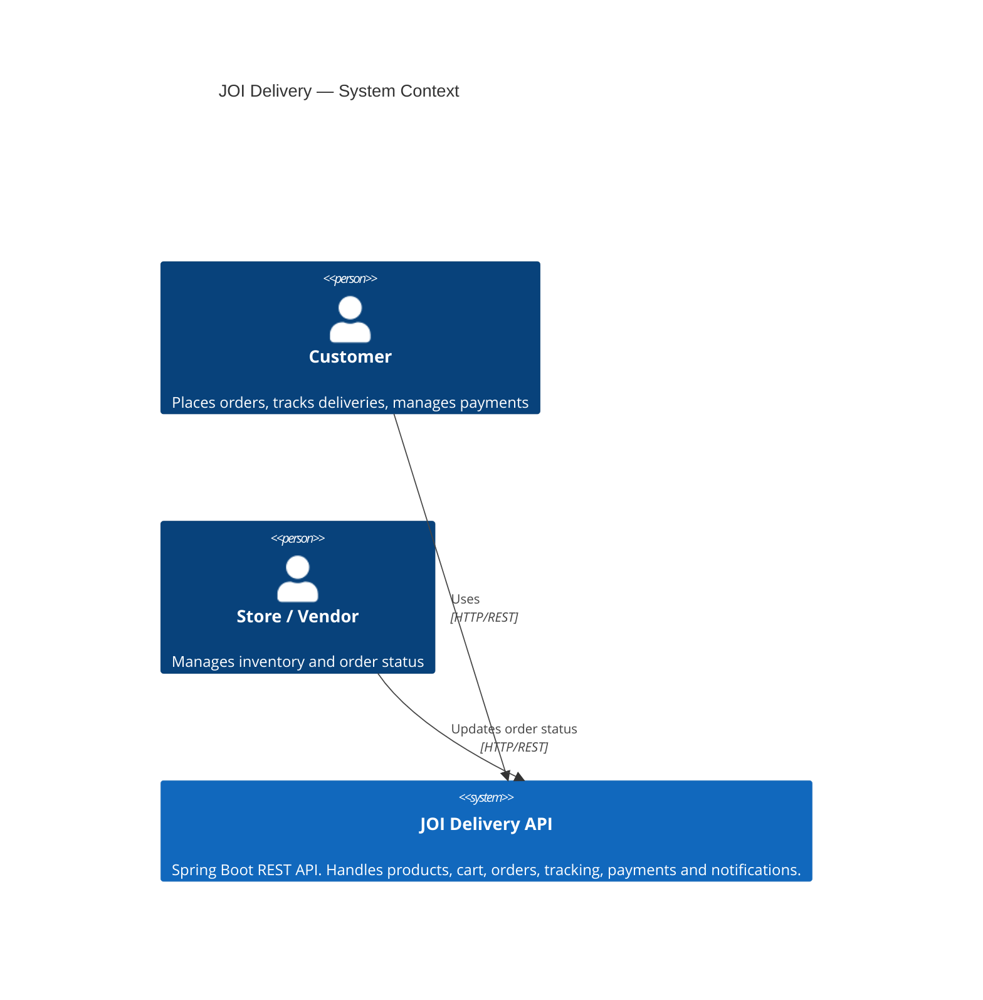
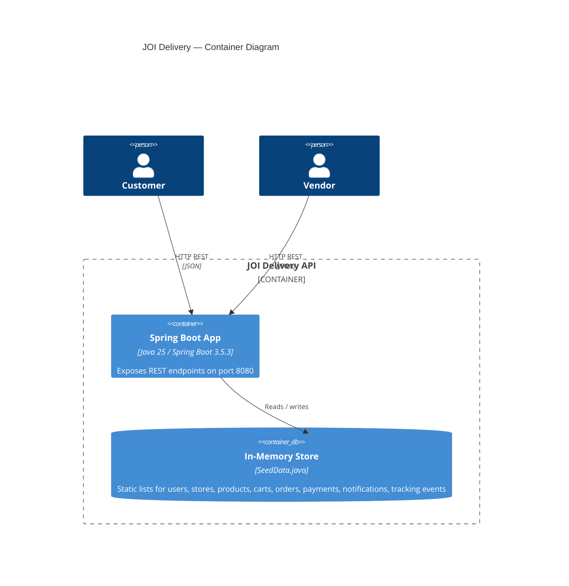
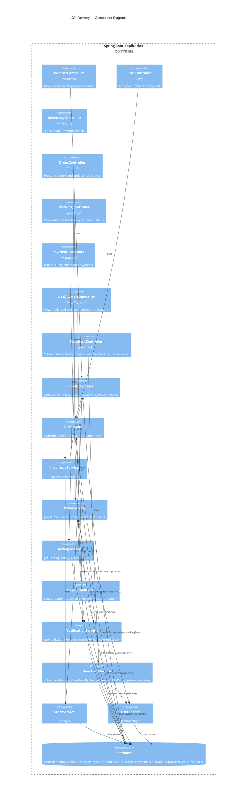
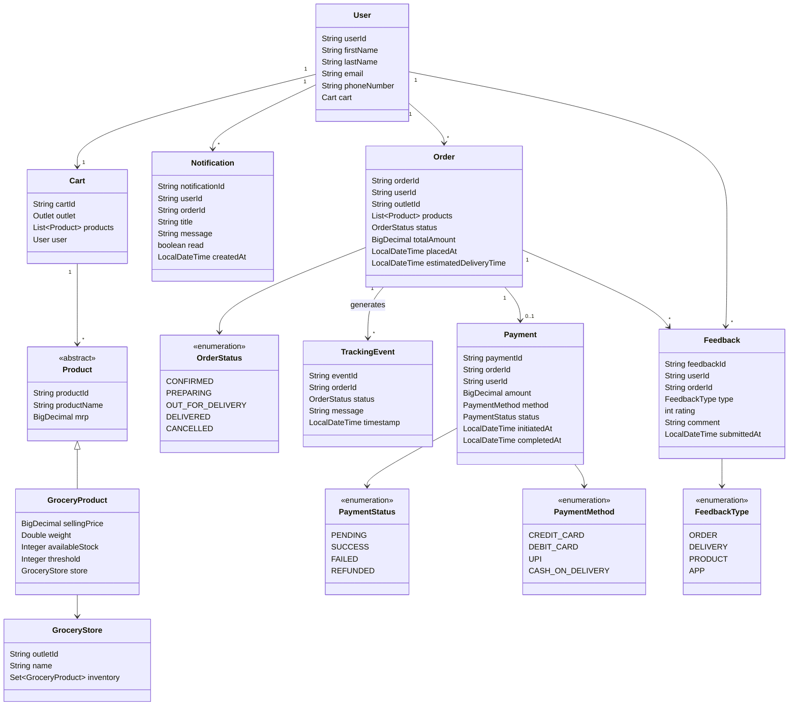
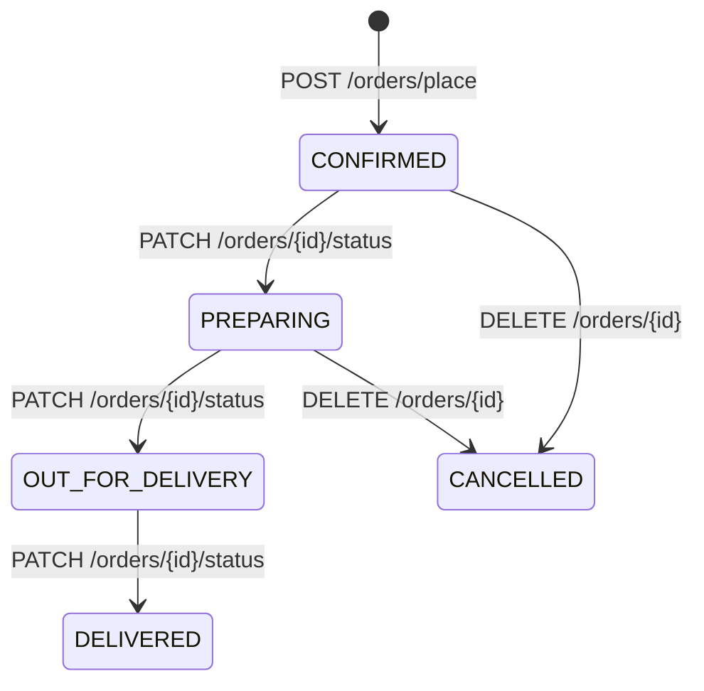
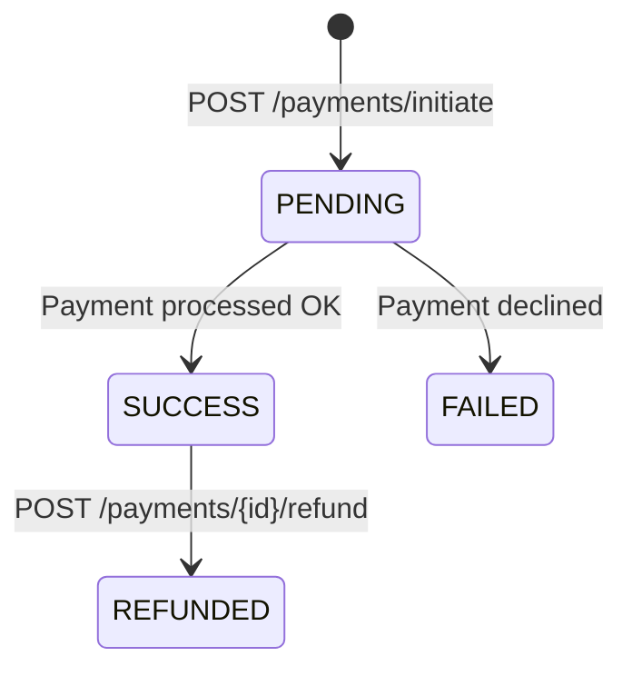

# JOI Delivery — Development Guide

## Business Flow

End-to-end journey of a customer from discovering products to receiving their delivery.

```mermaid
flowchart TD
    A([🛒 Customer opens app]) --> B[Browse stores & products\nGET /products?storeId=]
    B --> C{Found what\nthey need?}
    C -- No --> B
    C -- Yes --> D[Search by name\nGET /products/search?query=]
    D --> E[Add product to cart\nPOST /cart/product]
    E --> F{Add more\nproducts?}
    F -- Yes --> B
    F -- No --> G[Review cart\nGET /cart/view]

    G --> H[Place order\nPOST /orders/place]
    H --> I[🔔 Notification: Order Confirmed]
    I --> J[Choose payment method\nCredit Card / UPI / Cash on Delivery]
    J --> K[Initiate payment\nPOST /payments/initiate\nheader: X-Idempotency-Key]

    K --> L{Payment\nsuccessful?}
    L -- No --> M[🔔 Notification: Payment Failed]
    M --> N[Retry with same\nIdempotency Key]
    N --> K

    L -- Yes --> O[🔔 Notification: Payment Successful]
    O --> P[Order being prepared\nStatus: PREPARING]
    P --> Q[🔔 Notification: Preparing your order]
    Q --> R[Rider picks up order\nStatus: OUT_FOR_DELIVERY]
    R --> S[🔔 Notification: Order on its way]
    S --> T[Track in real time\nGET /tracking/orderId/status]
    T --> U[Order delivered\nStatus: DELIVERED]
    U --> V[🔔 Notification: Order Delivered]

    V --> W{Need a\nrefund?}
    W -- Yes --> X[Request refund\nPOST /payments/paymentId/refund]
    X --> Y[🔔 Notification: Payment Refunded]
    W -- No --> FB[Leave feedback & rating\nPOST /feedback]
    Y --> FB
    FB --> Z([✅ Done])

    style A fill:#4CAF50,color:#fff
    style Z fill:#4CAF50,color:#fff
    style I fill:#2196F3,color:#fff
    style O fill:#2196F3,color:#fff
    style Q fill:#2196F3,color:#fff
    style S fill:#2196F3,color:#fff
    style V fill:#2196F3,color:#fff
    style Y fill:#2196F3,color:#fff
    style M fill:#f44336,color:#fff
```



> **🔔 Notifications** are generated automatically at every key transition — the customer is always informed without having to poll for status.
>
> **🔑 Idempotency Key** — `POST /payments/initiate` requires a `X-Idempotency-Key` header. Retrying with the same key returns the cached result without creating a duplicate payment.

---

## Architecture Overview

JOI Delivery is a Spring Boot 3.5.3 / Java 25 REST API. All data lives in-memory via `SeedData` — there is no database. The application is structured in three layers: Controllers → Services → Domain/SeedData.

---

## C4 — Level 1: System Context



---

## C4 — Level 2: Container



---

## C4 — Level 3: Component



---

## Architectural Patterns

### Idempotency Key — Payment fault tolerance

`POST /payments/initiate` implements the **Idempotency Key** pattern to prevent duplicate charges on client retries (network timeouts, app crashes mid-request).

**How it works:**

```
Client                          API                        idempotencyStore (Map)
  │                              │                                │
  │── POST /payments/initiate ──►│                                │
  │   X-Idempotency-Key: abc123  │── get("abc123") ─────────────►│ (miss)
  │                              │                                │
  │                              │  [process payment]             │
  │                              │── put("abc123", payment) ─────►│
  │◄─ 201 { paymentId: "p-1" } ──│                                │
  │                              │                                │
  │  [timeout / retry]           │                                │
  │── POST /payments/initiate ──►│                                │
  │   X-Idempotency-Key: abc123  │── get("abc123") ─────────────►│ (hit)
  │◄─ 201 { paymentId: "p-1" } ──│◄── return cached payment ──────│
  │   (same result, no charge)   │                                │
```

**Rules:**
- Same key → same response, no second charge, `SeedData.payments` stays at size 1
- Different key → new payment processed independently
- The store is a `ConcurrentHashMap<String, Payment>` in `SeedData.idempotencyStore`

---

## API Endpoints

| Method | Path | Description |
|--------|------|-------------|
| `GET` | `/products?storeId=` | List products for a store |
| `GET` | `/products/search?query=` | Search products by name (all stores) |
| `GET` | `/products/{productId}?storeId=` | Get product detail |
| `POST` | `/cart/product` | Add product to cart |
| `GET` | `/cart/view?userId=` | View cart |
| `GET` | `/inventory/health?storeId=` | Inventory health for a store |
| `POST` | `/orders/place?userId=` | Place order from cart |
| `GET` | `/orders?userId=` | List orders for a user |
| `DELETE` | `/orders/{orderId}?userId=` | Cancel an order |
| `PATCH` | `/orders/{orderId}/status?userId=` | Update order status |
| `GET` | `/tracking/{orderId}` | Full tracking history for an order |
| `GET` | `/tracking/{orderId}/status` | Latest tracking status |
| `POST` | `/payments/initiate` | Initiate a payment _(requires `X-Idempotency-Key` header)_ |
| `GET` | `/payments/order/{orderId}?userId=` | Get payment for an order |
| `POST` | `/payments/{paymentId}/refund?userId=` | Refund a payment |
| `GET` | `/notifications?userId=` | List notifications |
| `GET` | `/notifications/unread-count?userId=` | Count unread notifications |
| `PATCH` | `/notifications/{id}/read?userId=` | Mark notification as read |
| `PATCH` | `/notifications/read-all?userId=` | Mark all notifications as read |
| `POST` | `/feedback` | Submit a rating and comment |
| `GET` | `/feedback/user?userId=` | Get all feedback submitted by a user |
| `GET` | `/feedback/order/{orderId}` | Get all feedback for a specific order |
| `GET` | `/feedback/store/{storeId}/rating` | Get average rating for a store |

---

## Domain Model



---

## Order Lifecycle



---

## Payment Lifecycle



---

## Seed Data (Development)

| Entity | Id | Detail |
|--------|----|--------|
| User | `user101` | John Doe — john.doe@gmail.com |
| Store | `store101` | Fresh Picks |
| Store | `store102` | Natural Choice |
| Product | `product101` | Wheat Bread — store101 |
| Product | `product102` | Spinach — store101 |
| Product | `product103` | Crackers — store101 |
| Product | `product104` | Organic Milk — store102 |
| Product | `product105` | Brown Rice — store102 |

---

## Running the project

```bash
# Build and test
./gradlew build

# Run (port 8080)
./gradlew bootRun

# Unit tests only
./gradlew test

# Unit + functional tests
./gradlew check
```
